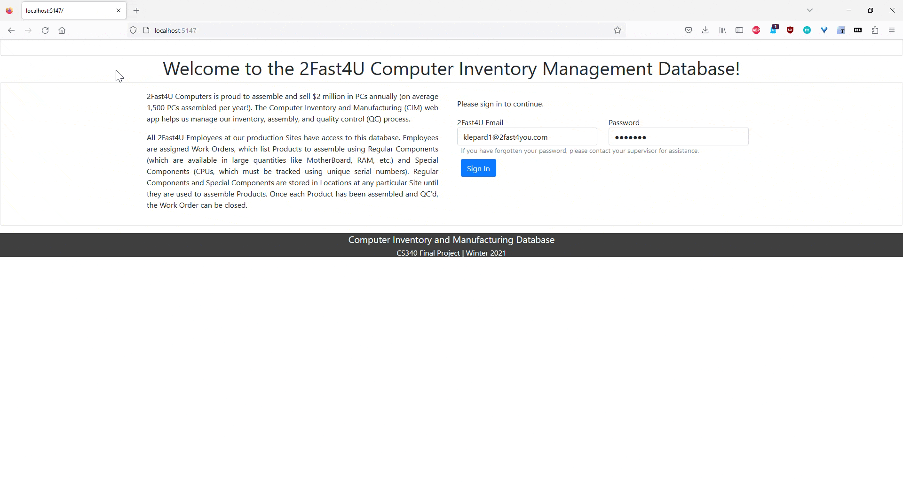
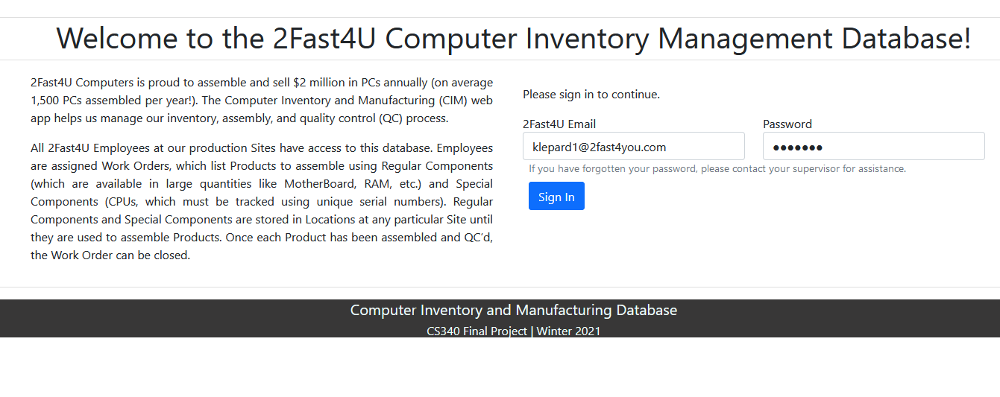
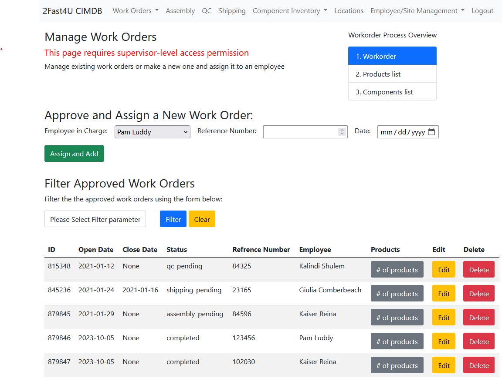
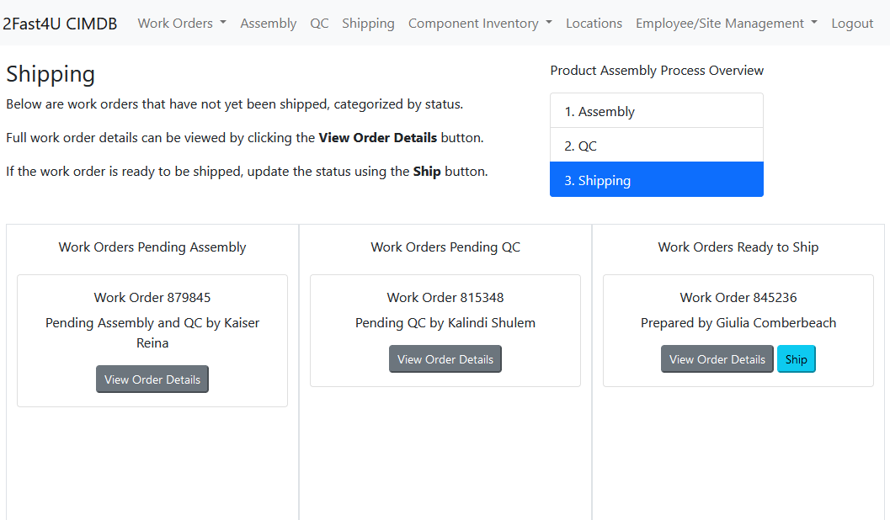

# 2Fast4U Computer Inventory Management Database (CIMDB)
Web-based CRUD database based on `Python`, `Flask` and `MySQL`. 

<!-- ABOUT THE PROJECT -->
## About The Project

2Fast4U Computers assembles and sells $2 million in PCs annually (on average 1,500 PCs assembled per year). The Computer Inventory and Manufacturing (CIM) web app will help manage the inventory, assembly, and quality control (QC) process for 2Fast4U. The state of the art database (DB) behind the CIM webapp will be used by 2Fast4U Employees at different production Sites. Employees are assigned Work Orders, which list Products to assemble using Regular Components (which are available in large quantities like MotherBoard, RAM, etc.) and Special Components (CPUs, which must be tracked using unique serial numbers). Regular Components and Special Components are stored in Locations at any particular Site until they are used to assemble Products. Once each Product has been assembled and QC’d, the Work Order can be closed.

This class project was built for Oregon State's CS340 Databases class in Winter 2021.

## Screenshots

<!-- ### Built With -->
### Built With
* [Flask](https://flask.palletsprojects.com/en/1.1.x/): a backend framework for Python used to develop web applications. 
* [Bootstrap](https://getbootstrap.com/docs/4.0/getting-started/introduction/): a Python framework for responsive web styling.
* [MySQL](https://dev.mysql.com/doc/): a relational database management system.

<!-- LICENSE -->
## License

Distributed under the MIT License. See [LICENSE](https://github.com/team-cs-cats/cimdb/LICENSE.txt) for more information.

<!-- CONTACT -->
## Contact

Ali Jalilian - jaliliam@oregonstate.edu
Asa LeHolland - hollaasa@oregonstate.edu

Project Link: [https://github.com/team-cs-cats/cimdb](https://github.com/team-cs-cats/cimdb)

<!-- ACKNOWLEDGEMENTS -->
## Acknowledgements

* [othneildrew](https://github.com/othneildrew) for creating the [template README file](https://github.com/othneildrew/Best-README-Template) that was used as the starting point for the README for this project. 

